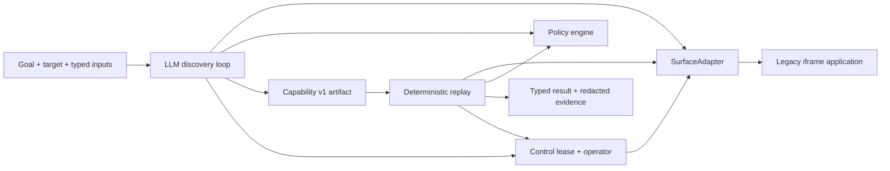

# Computer-Use Automation System

A complete vertical slice for turning one LLM-driven UI run into a typed, reviewable capability that replays without an LLM. The concrete target is an intentionally awkward, server-rendered banking demo with an iframe, tables, no test IDs, synthetic data, injected faults, and a risky workflow that requires human control.

The model discovers. The artifact becomes the capability. The replay engine invokes it deterministically.

## What is implemented

- Goal-driven screenshot + control-metadata `observe → decide → act` discovery using the OpenAI Responses API and strict structured outputs.
- A Zod-validated, versioned capability contract with typed inputs/outputs, ordered steps, locator bundles, checkpoints, risk classes, retries, and known outcomes.
- Model-free replay with unique locator resolution, frame-aware targeting, bounded recovery, and three result variants: `success`, `business_outcome`, and `failure`.
- Domain, route, action, and risk policy enforcement before actions execute.
- Redacted JSONL evidence and screenshots on intervention or failure.
- A real same-browser-session handoff seam with exclusive ownership states and human-action auditing.
- 24 tests covering schemas, policy, redaction, the legacy surface, live browser replay, discovery-to-replay reuse, failure taxonomy, recovery, and handoff.

## Architecture



`SurfaceAdapter` is the boundary between perception/action and the recorded capability. Playwright is the current browser implementation; runtime candidate IDs never enter the artifact. The artifact stores ordered stable locator strategies scoped to a frame. See [REPORT.md](REPORT.md) for decisions and trade-offs.

## Prerequisites

- Node.js 22 or newer
- pnpm 11 (the repository pins `pnpm@11.19.0`)
- An OpenAI API key only for genuine discovery; replay and tests do not call live services

## Setup

```bash
corepack enable
pnpm install --frozen-lockfile
pnpm exec playwright install chromium
cp .env.example .env.local
```

Put a project-scoped key in `.env.local`:

```dotenv
OPENAI_API_KEY=your_key_here
OPENAI_MODEL=
```

When `OPENAI_MODEL` is blank, discovery uses `gpt-6-astra`. Set it explicitly to use another Responses API model that supports image input and strict JSON-schema output. `.env.local` and all `.env.*` files other than the blank example are ignored by Git.

The commands below start and stop the local demo automatically at `http://127.0.0.1:4317`. If that port is occupied, set another local port with `DEMO_BASE_URL=http://127.0.0.1:4321`.

## End-to-end demo

1. Run genuine LLM discovery and save the resulting capability:

```bash
pnpm discover -- \
  --goal "Look up the supplied member and return their savings balance" \
  --member-id 10001 \
  --artifact evidence/capability.json
```

2. Replay that artifact with a different invocation input and no LLM:

```bash
pnpm replay -- \
  --artifact evidence/capability.json \
  --member-id 10002
```

The CLI prints results through the same redactor used for evidence, so declared sensitive values appear as `[REDACTED:...]`.

## Error and recovery demos

```bash
# Legitimate domain result; exits successfully with status=business_outcome.
pnpm replay -- --artifact evidence/capability.json --member-id 99999

# Hard authorization failure; exits nonzero and saves failure.png.
pnpm replay -- --artifact evidence/capability.json --member-id 90001

# Known interstitial; dismisses once, retries, and succeeds.
pnpm replay -- --artifact evidence/capability.json --member-id 10002 --fault dialog

# Other injected hard/runtime conditions.
pnpm replay -- --artifact evidence/capability.json --member-id 10002 --fault session
pnpm replay -- --artifact evidence/capability.json --member-id 10002 --fault slow
```

## Human handoff demo

Launch a visible browser and wait for the risky identity-attestation step:

```bash
pnpm demo:handoff -- --member-id 10001 --headed
```

When prompted, operate the already-open browser. Check **Identity verified**, then enter `c` in the terminal to report that the step is complete. Replay resumes in the same browser context and reaches the non-committing review screen. The control lease and trusted browser events are recorded.

For an unattended demonstration, the mock operator uses that same handoff/control path:

```bash
pnpm demo:handoff -- --member-id 10001 --auto-human
```

## Verification without an API key

```bash
pnpm check
```

Tests start the local demo and Chromium themselves. They use a scripted decision provider to test the discovery core offline; only `pnpm discover` requires OpenAI.

## Included evidence

- [`evidence/capability.json`](evidence/capability.json): artifact emitted by the genuine discovery run.
- [`evidence/discovery-live/events.jsonl`](evidence/discovery-live/events.jsonl): OpenAI `gpt-6-astra` discovery decisions and actions.
- [`evidence/replay-success/events.jsonl`](evidence/replay-success/events.jsonl): deterministic replay with a different member.
- [`evidence/replay-not-found/events.jsonl`](evidence/replay-not-found/events.jsonl): expected business outcome.
- [`evidence/replay-recovered-dialog/events.jsonl`](evidence/replay-recovered-dialog/events.jsonl): explicit bounded recovery.
- [`evidence/replay-permission-denied/`](evidence/replay-permission-denied): structured failure plus screenshot.
- [`evidence/handoff-same-session/`](evidence/handoff-same-session): control transitions, operator action, intervention screenshot, and resumed success.

All members and balances are synthetic. Evidence was scanned for the configured values and API-key patterns before commit.
